## Análise de design de interfaces gráficas
O objetivo deste trabalho é analisar erros e acertos cometidos no design de interfaces e usabilidade sob a perspectiva das 10 heurísticas propostas por Jakob Nielsen.

### 1 - Visibilidade do status do sistema
O sistema deve fornecer recursos para deixar o usuário ciente da situação onde ele se encontra. Ex: progresso de tarefas, permitir que o usuário se localize.
 
 

**Erro:** A ação de abrir o discord deixa a tela completamente cinza por uns segundos, sem deixar claro que a aplicação está carregando, gerando dúvidas sobre o seu estado.

 
 

**Acerto:** Na página da biblioteca da steam, o sistema informa o estado atual de um jogo no seu computador e o status do download.
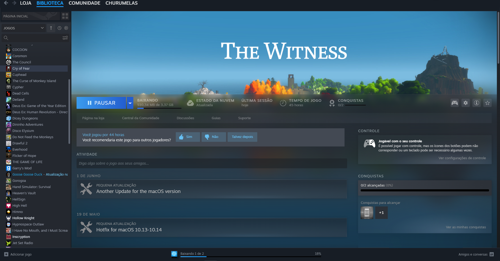

### 2 - Compatibilidade entre o sistema e o mundo real
Deve-se utilizar de linguagem que seja de fácil entendimento para o usuário, não só em textos, mas também imagens, conceitos, etc. Apresentar as informações de uma forma natural e lógica.
 
 

**Erro:** O Siga apresenta o horário do aluno utilizando as siglas das matérias e com tabelas separadas em vez de uma só tabela para todos os dias, dificultando o entendimento.
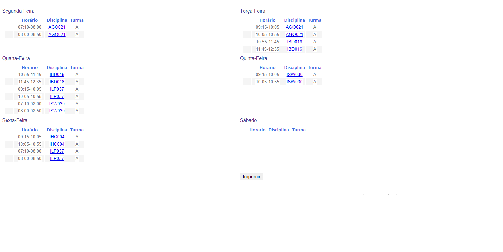
 
 

**Acerto:** Utilização de ícones de objetos do mundo real na barra de tarefas (impressora na função de imprimir, caneta para desenhar, borracha para apagar, etc). Além da funcionalidade de grifar o texto com um marca-texto assim como num livro físico.
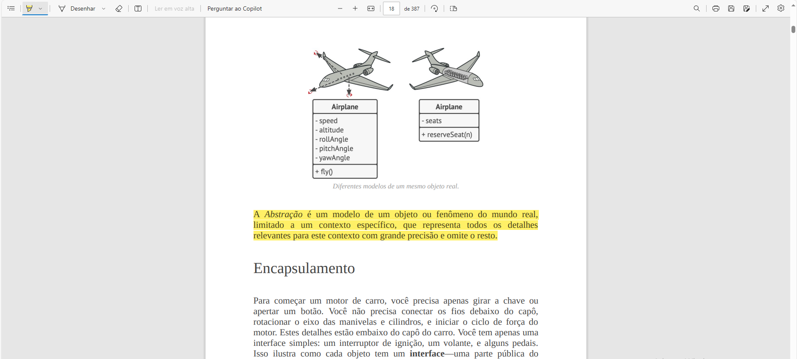

### 3 - Controle e liberdade para o usuário
Fornecer recursos que passem segurança para o usuário. Poder desfazer ou refazer ações feitas por engano e que podem ter um efeito negativo.
 
 

**Erro:** O software de modelagem de banco de dados não oferece um atalho para desfazer as ações, como o conhecido crtl + z.
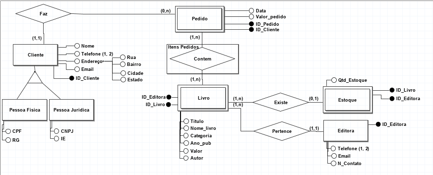
 
 

**Acerto:** No gmail, os emails não enviados ficam salvos como rascunho e ao deletar um rascunho você tem a opção de desfazer a ação imediatamente.
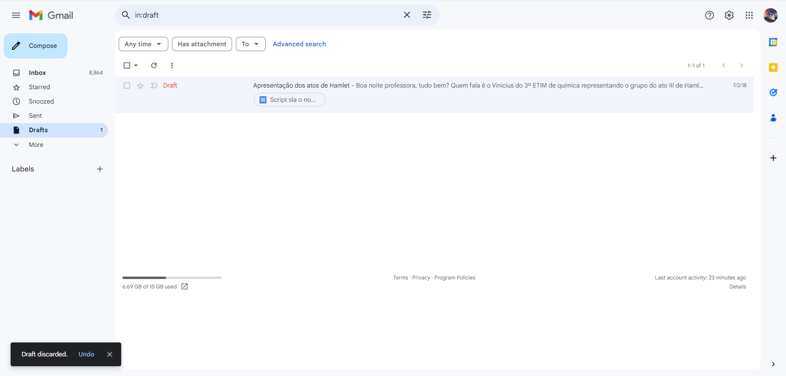

### 4 - Consistência e padrões
O sistema deve manter consistência visual de seus elementos por toda a interface e, se possível, seguir convenções da indústria, evitando suposições por parte do usuário.
 
 

**Erro:** Utilização da cor vermelha é uma convenção para erros ou alguma ação que pode trazer risco.
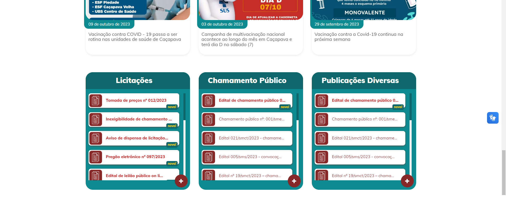

 
 

**Acerto:** No reddit todas as ações possíveis num post possuem a mesma cor de destaque (a cor principal da comunidade). Além de seguir o padrão da ação principal (comentar) ser um botão em destaque no canto inferior direito.
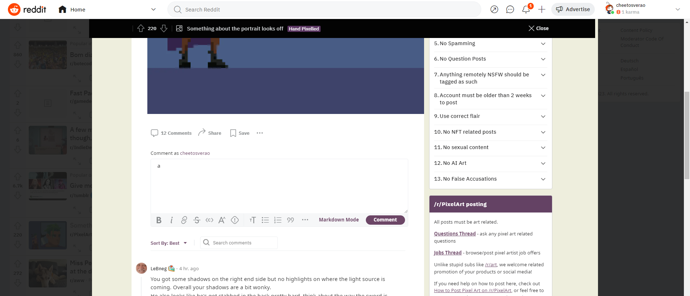

### 5 - Prevenção de erros
Priorizar a prevenção de erros que o usuário possa cometer acima de informar o erro em si. Cercar ações críticas de confirmações.
 
 

**Erro:** O Teams não informa o usuário caso ele faça a entrega de uma atividade sem anexar o arquivo dela.
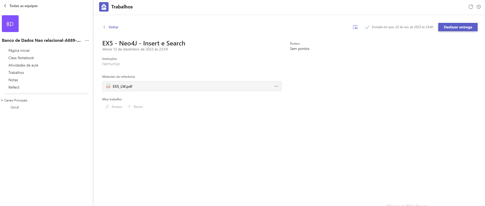

 
 

**Acerto:** O github faz você confirmar algumas vezes e de diferentes formas, inclusive escrever o nome inteiro do repositório, antes de poder apagá-lo.

### 6 - Reconhecimento acima de memorização
Manter os elementos importante do sistema acessíveis de forma fácil para o usuário, evitando que seja necessário para ele decorar essas informações ou como acessá-las.
 
 

**Acerto:** O explorador de arquivos do windows tem uma aba que lista todos os arquivos recentes na qual o usuário teve alguma influência. Evita o processo do usuário ter que se lembrar em qual diretório o arquivo se encontra.
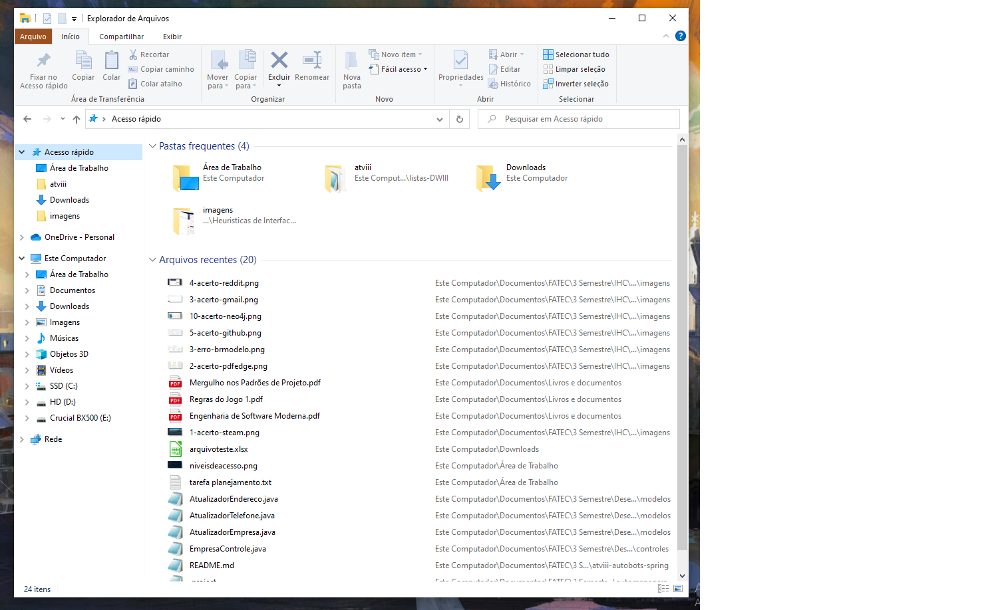

### 7 - Flexibilidade e eficiência de uso
Projetar a interface pensando em diferentes níveis de conhecimento do sistema, com informações para os novatos e formas mais ágeis para aqueles que possuem experiência.
 
 

**Acerto:** Em editores de texto como o Word, LibreOffice Writer e afins você consegue realizar a maioria das ações pelos menus na interface, mas os mesmos também mostram alternativas de atalhos pelo teclado para agilizar o processo.
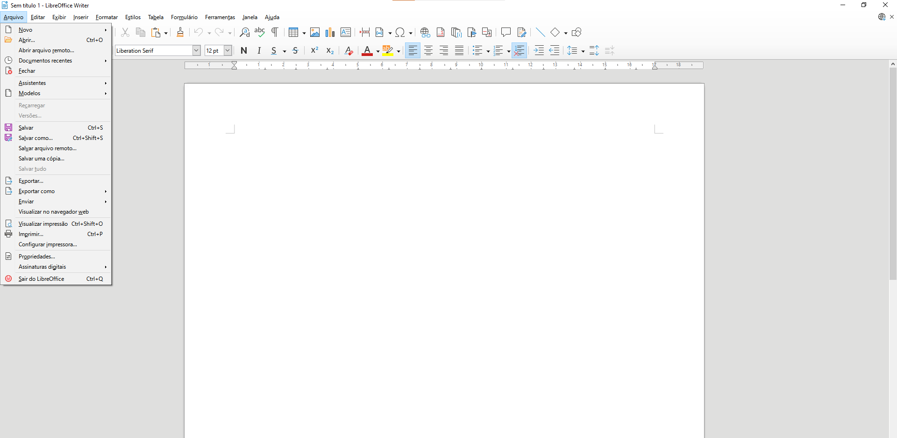

### 8 - Estética e design minimalista
Priorizar o conteúdo a fim de manter o foco visual da interface nos elementos mais importantes.
 
 

**Erro:** O site de notícia do msn é bombardeado de informações assim que você entra.
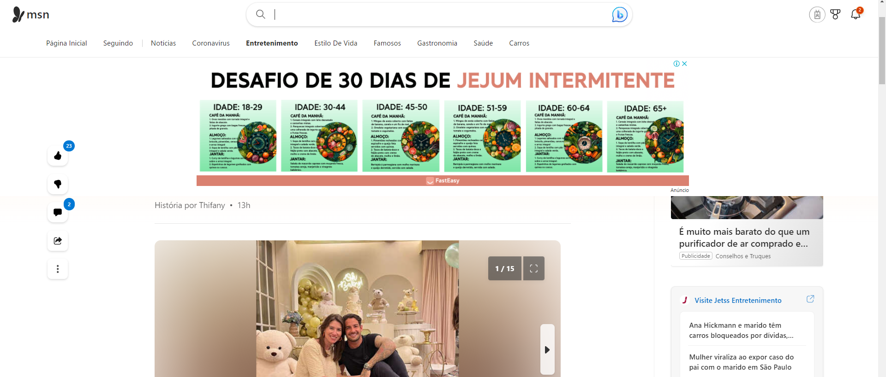

 
 

**Acerto:** A interface dos artigos do Medium é bem mais limpa e foca no conteúdo principal.
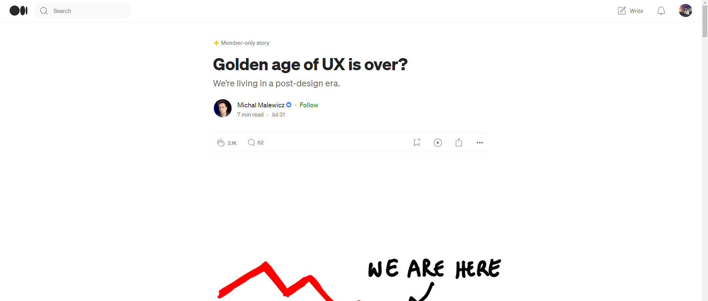

### 9 - Ajude os usuários a reconhecer, entender e se recuperar de erros
Escrever mensagens de erros claras, que indiquem o problema e, se possível, sugerir uma solução.
 
 

**Acerto:** O site descreve o erro de forma entendível e oferece opções para contornar.
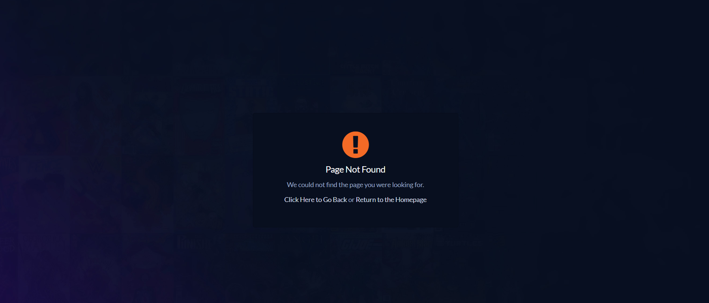

### 10 - Ajuda e documentação
Caso necessário, forneça documentação de uma forma simples de encontrar e que seja escrita focada no passo a passo necessário para o usuário executar uma determinada tarefa.
 
 

**Erro:** O software de jogos do WiiU é cheio de opções que podem parecer complexas e a aba de ajuda não fornece informações suficientes.
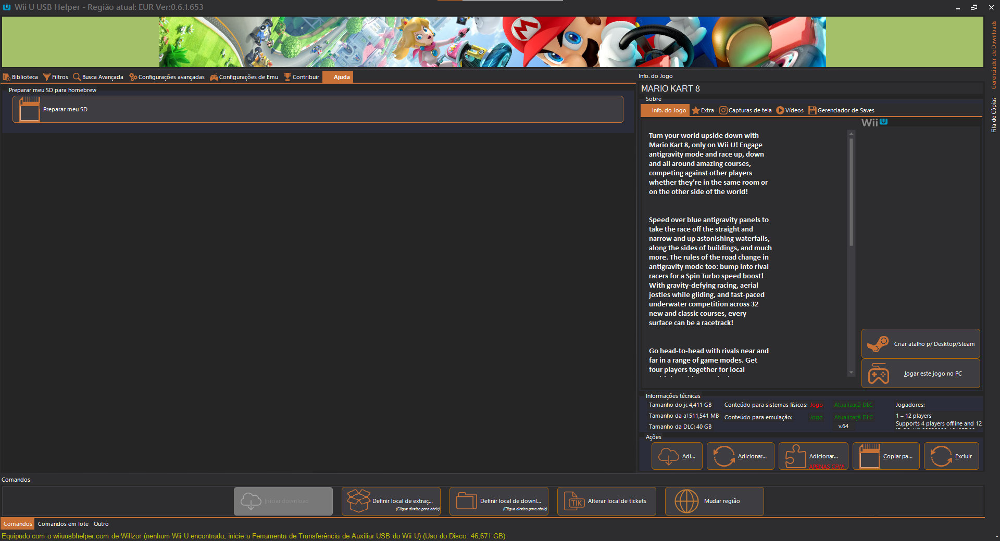

 
 

**Acerto:** A plataforma online do neo4j deixa sempre disponível tutoriais tanto para a plataforma quanto para utilizar a tecnologia.
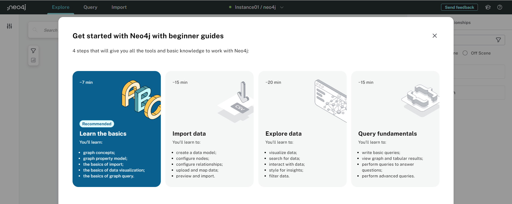

